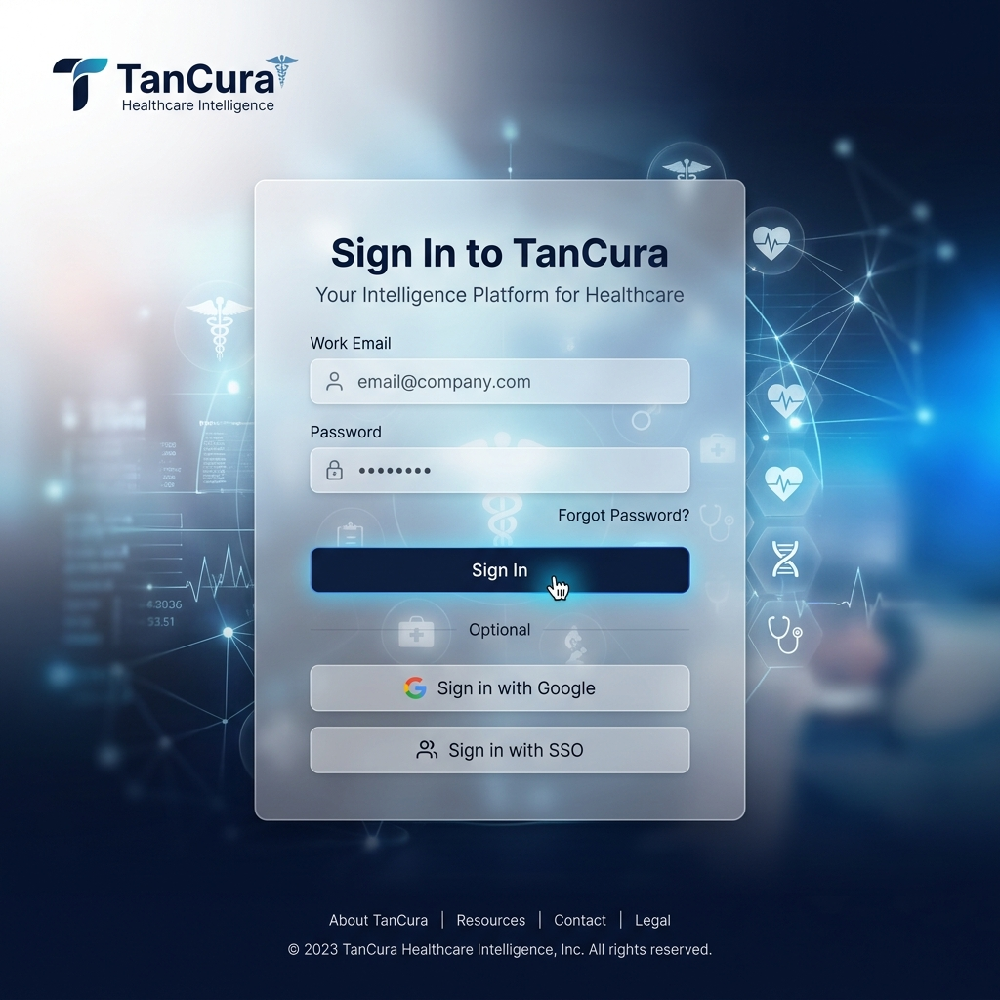
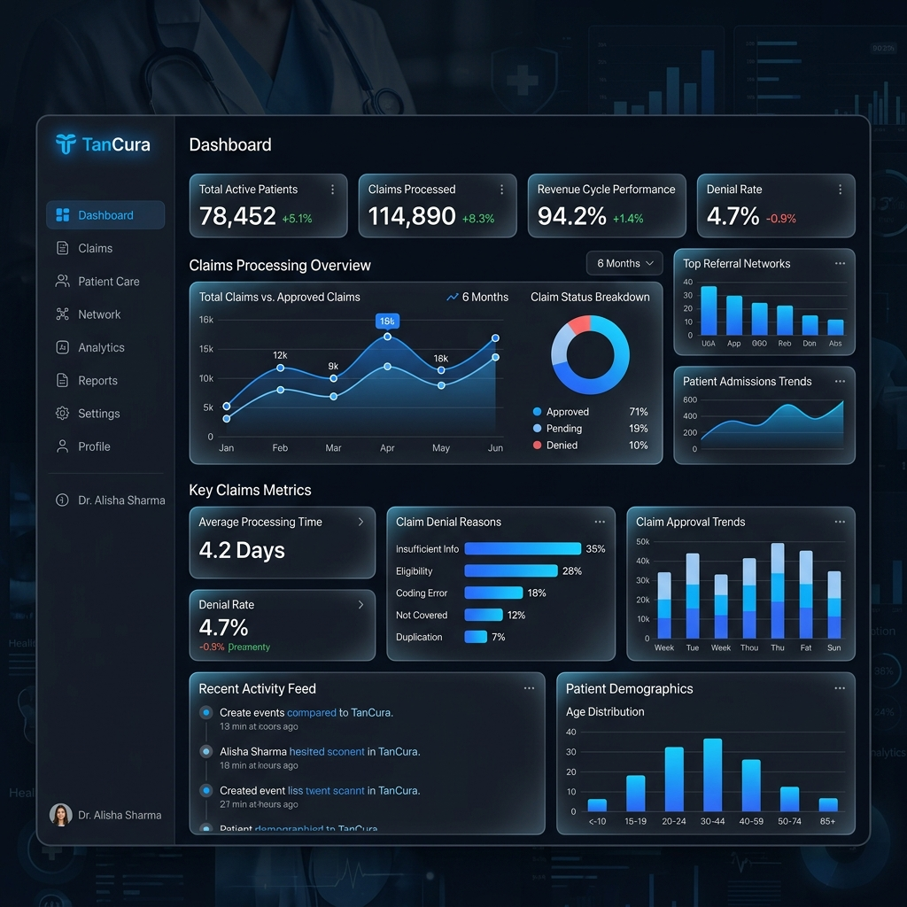

# 🛡️ TanCura: Healthcare Intelligence Platform

[](https://tanishqvarshney.github.io/MediTrack-Patient-Claims-Prescription-Management-System/)
[](https://opensource.org/licenses/MIT)
[](https://tancura.io)

TanCura is a **production-grade, intelligence-driven healthcare platform** designed for high-performance claims management and pharmaceutical benefit orchestration. Built with a modern, cloud-native architecture, it delivers a FAANG-level user experience while maintaining strict compliance and audit standards.

---

## 🖼️ Visual Walkthrough

### 1. Cinematic Intelligence Portal
Experience a premium, secure entry point designed with high-fidelity glassmorphism and modern security standards.


### 2. High-Performance Dashboard
A centralized intelligence hub featuring real-time data visualization, clinical metrics, and predictive claim analytics.


---

## ✨ Key Features

*   **Intelligence Dashboard**: High-fidelity data visualization for claims processing, rejected cases, and provider metrics.
*   **Pharmaceutical Oracle**: Real-time formulary lookup and drug benefit verification with NDC-level precision.
*   **Automated Adjudication**: Background worker service for asynchronous claim status transitions.
*   **Premium Design System**: Cinematic "Midnight Slate" dark-mode interface with glassmorphic components and fluid micro-animations.
*   **Audit Mastery**: Comprehensive transaction logging for every PHI access and clinical decision.

---

## 🏗 System Architecture

```mermaid
graph TD
    A[TanCura Web Client] --> B[Nginx Reverse Proxy]
    B --> C[Claims API (ASP.NET Core 8)]
    C --> D[(SQL Server 2022)]
    D --> E[Intelligent Worker Service]
    E --> F[Mock Payer Clearinghouse]
    C --> G[Redis Cache]
```

---

## 🚀 Quick Start (Docker Orchestration)

Deploy the entire intelligence platform in minutes:

```bash
# 1. Initialize environment
cp .env.example .env

# 2. Launch the ecosystem
docker-compose up -d --build

# 3. Access Points
#    Frontend:    http://localhost:4200 (Dashboard)
#    API Gateway: http://localhost:5001/swagger (Interactive Docs)
```

---

## 🔑 Default Credentials (Development)

| Persona | Identity | Access Key |
| :--- | :--- | :--- |
| **System Admin** | `admin@tancura.io` | `TanCura123!` |
| **Provider** | `provider@clinic.com` | `TanCura123!` |
| **Patient** | `patient@example.com` | `TanCura123!` |

---

## 🔧 Technical Stack

*   **Core**: .NET 8, C#, Entity Framework Core
*   **Frontend**: Angular 17, Material Design, TypeScript, CSS Custom Properties
*   **Storage**: MS SQL Server 2022, Redis 7
*   **Infrastructure**: Docker, Nginx, GitHub Actions (CI/CD)

---

## 🧪 Verification & Testing

TanCura maintains a zero-regression policy with comprehensive test coverage:

```bash
# Backend Suite
dotnet test backend/TanCura.Tests

# Frontend Suite
cd frontend && npm test
```

---

## 📜 License

Distributed under the MIT License. See `LICENSE` for more information.

---

© 2024 **TanCura Healthcare Intelligence**. All rights reserved.
