# 🛡️ TanCura: Healthcare Intelligence Platform

[](https://tanishqvarshney.github.io/MediTrack-Patient-Claims-Prescription-Management-System/)
[](https://opensource.org/licenses/MIT)
[](https://tanishqvarshney.github.io/MediTrack-Patient-Claims-Prescription-Management-System/)

**TanCura** is a premium, production-grade Healthcare Intelligence platform. It orchestrates complex medical claims, clinical adjudications, and pharmaceutical benefits with **FAANG-grade precision**. Built for a cinematic experience, TanCura combines advanced glassmorphism design with a high-performance .NET 8 / Angular 17 architecture.

---

## 🎥 Platform Walkthrough
Experience the full cinematic orchestration of the TanCura platform in action:
[](https://www.youtube.com/watch?v=O21aBlcPXGE)

---

## 🖼️ Visual Walkthrough

### 1. Cinematic Intelligence Portal
A secure, high-fidelity entry point featuring **frosted glassmorphism**, animated medical HUD overlays, and precision tactile interactions.
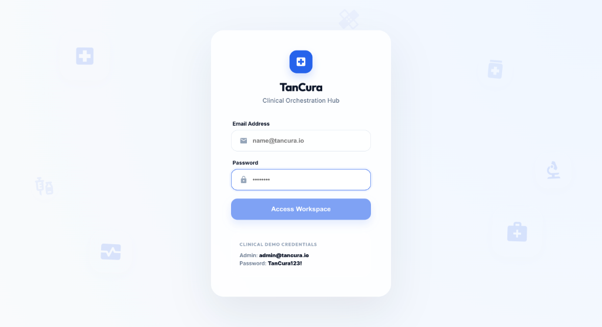

### 2. Strategic Intelligence Dashboard
The core hub for medical orchestration. Features real-time KPI monitoring, claims velocity tracking, and glass-accented clinical data visualization.
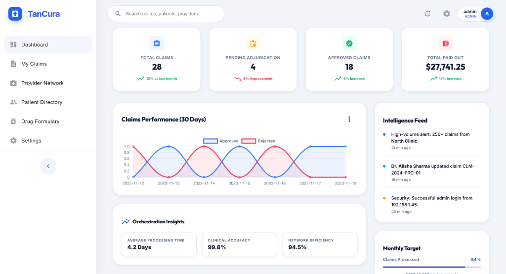

### 3. Clinical Ledger & Adjudication
Unified workspace for orchestrating complex clinical records with high-performance filtering and real-time status telemetry.
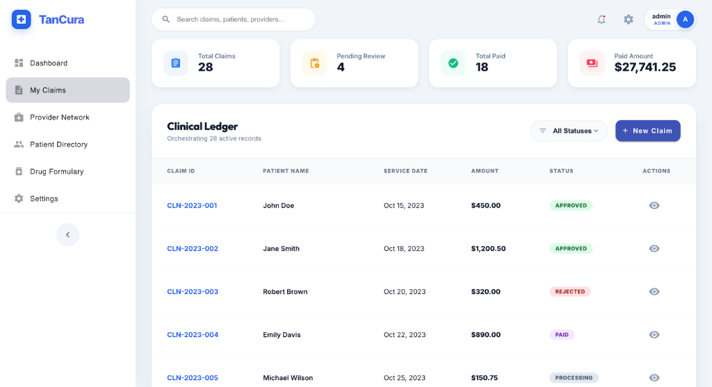

### 4. Assisted Claims Submission
Intelligence-assisted claim orchestration interface designed for clinical accuracy and provider network efficiency.
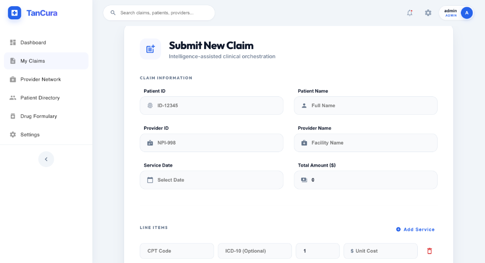

### 5. Provider Network Orchestration
Real-time orchestration of clinical facilities and specialists with integrated credentialing and status monitoring.
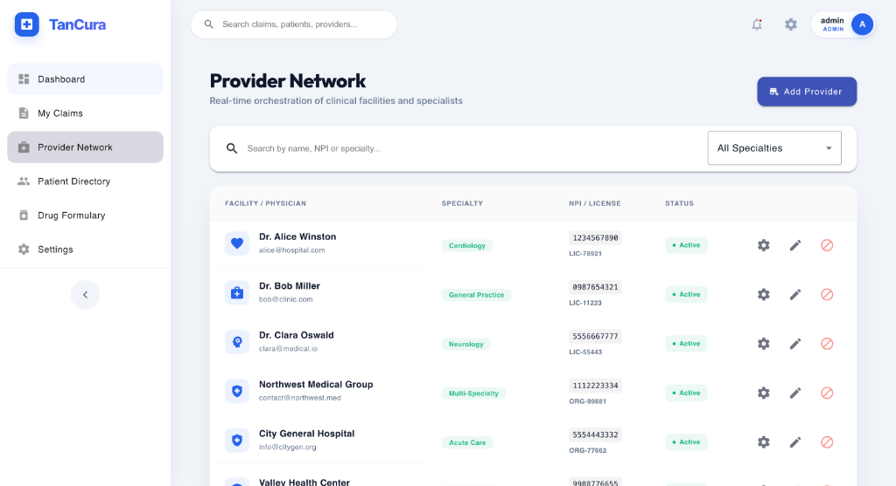

### 6. Comprehensive Patient Directory
Unified workspace for member record management featuring insurance plan tracking and clinical profile orchestration.
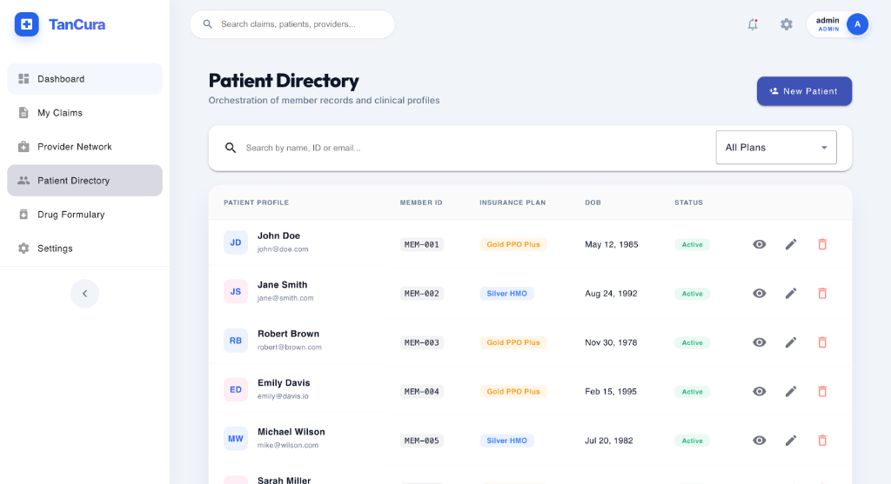

### 7. Intelligent Global Search
High-performance clinical search engine providing sub-second retrieval across claims, patients, and provider networks.
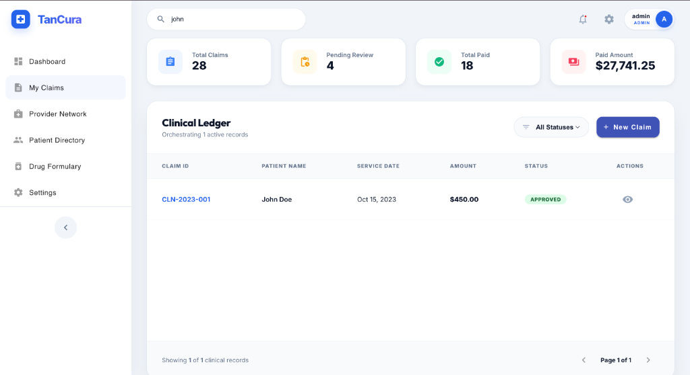

### 8. Surgical Clinical Modals
Advanced, task-oriented interfaces for member enrollment, provider registration, and credential updates.
````carousel
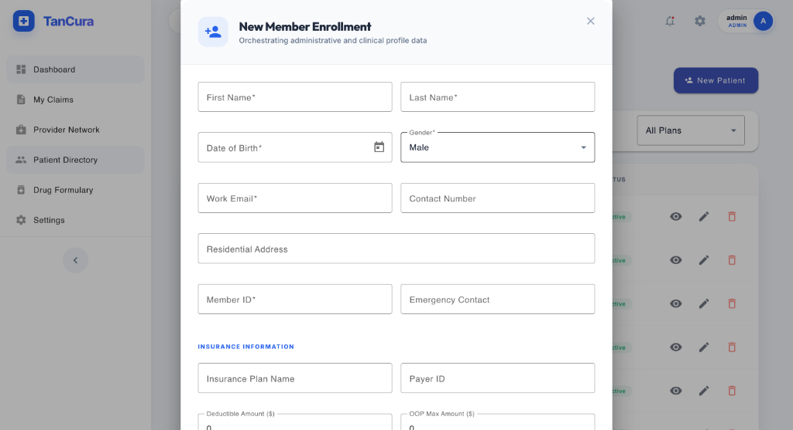
<!-- slide -->
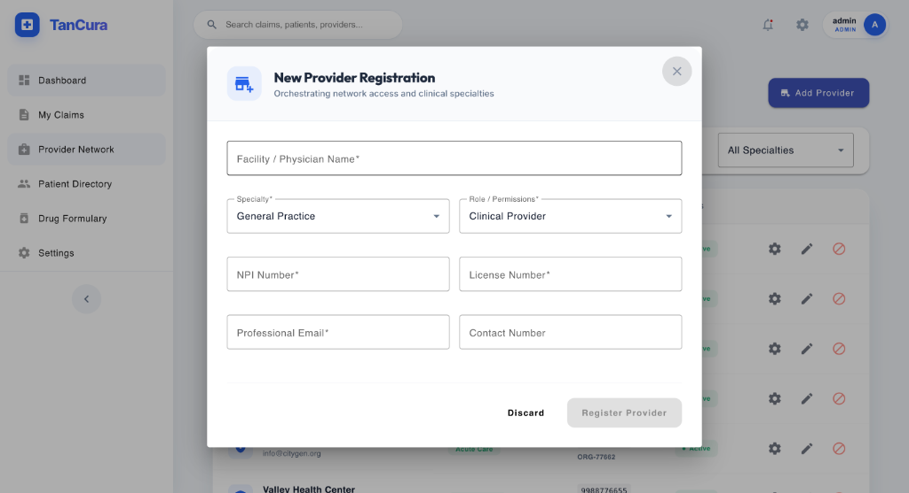
<!-- slide -->
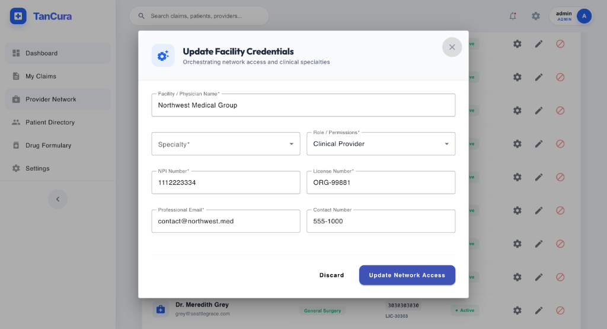
````

### 9. Pharmaceutical Benefit Verification
Real-time drug formulary search engine with integrated Tier-status tracking and prior authorization telemetry.
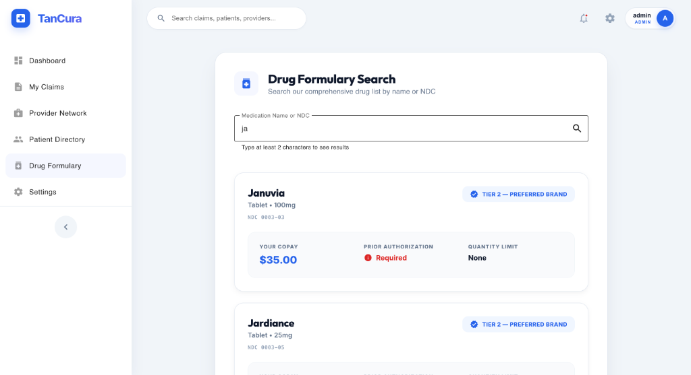

### 10. System Governance & Orchestration
Unified administrative control center for platform branding, security compliance, and clinical data lifecycle management.
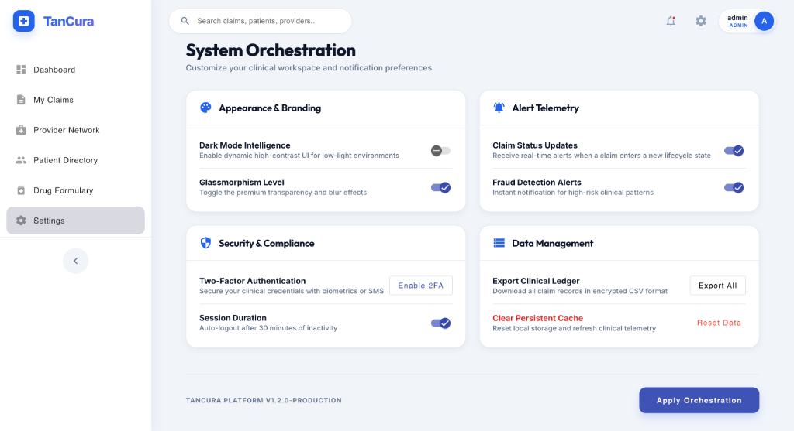

---

## 🚀 Key Intelligence Modules

*   **💎 High-Fidelity Glassmorphism**: A state-of-the-art UI system using backdrop-blur tokens, glowing crystalline borders, and fluid micro-animations.
*   **💊 Pharmaceutical Oracle**: Real-time pharmaceutical benefit verification engine with NDC-level clinical accuracy.
*   **📋 Clinical Claims Hub**: Unified workspace for claim submission, detailed adjudication viewing, and intelligent filtering.
*   **⚙️ Autonomous Adjudication**: A background-driven adjudication engine that manages claim lifecycles from "Pending" to "Paid" with zero manual intervention.
*   **🛡️ Audit Mastery**: Secure, immutable transaction logging for every clinical decision, ensuring 100% compliance and visibility.

---

## 🏗 System Architecture

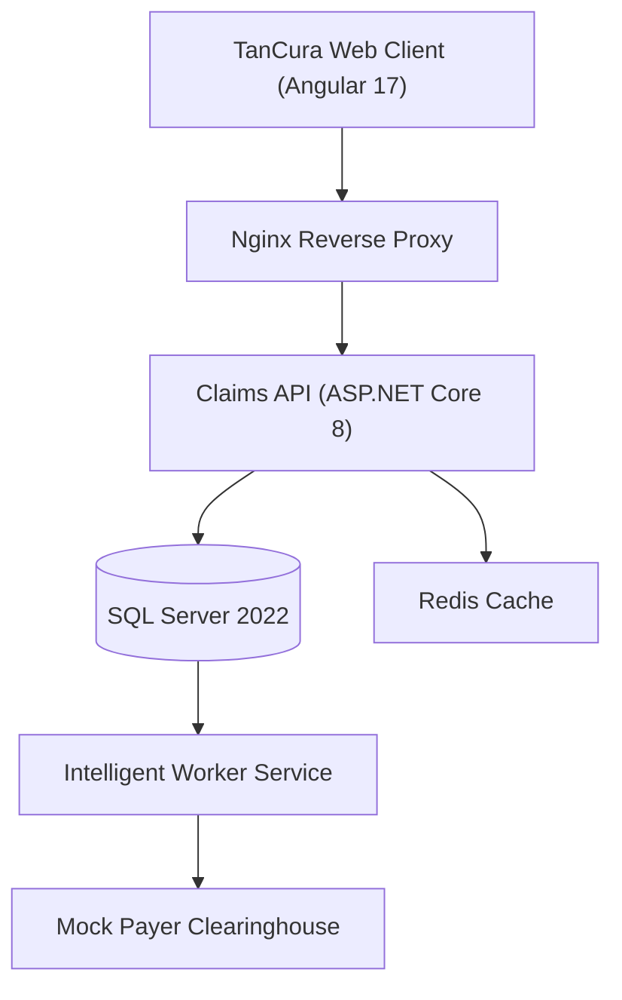

---

## 💻 Tech Stack & Engineering

*   **Frontend**: Angular 17, RxJS, SCSS (Crystalline Design System), Material 17
*   **Backend**: .NET 8 (Web API), Entity Framework Core 8, MediatR
*   **Persistence**: MS SQL Server 2022, Redis (Distributed Caching)
*   **Infrastructure**: Docker Orchestration, GitHub Actions (CI/CD)

---

## 🚦 Getting Started (Local Development)

Launch the entire ecosystem in under 3 minutes:

```bash
# 1. Initialize environment
cp .env.example .env

# 2. Launch the ecosystem via Docker
docker-compose up -d --build

# 3. Access Points
#    Intelligence Hub: http://localhost:4200
#    API Documentation: http://localhost:5001/swagger
```

### 🔑 Test Credentials

| Persona | Identity | Access Key |
| :--- | :--- | :--- |
| **System Admin** | `admin@tancura.io` | `TanCura123!` |
| **Provider** | `provider@clinic.com` | `TanCura123!` |
| **Patient** | `patient@example.com` | `TanCura123!` |

---

## 📜 License

Distributed under the MIT License. See `LICENSE` for more information.

---

© 2026 **TanCura Healthcare Intelligence**. Designed for the future of clinical orchestration.
